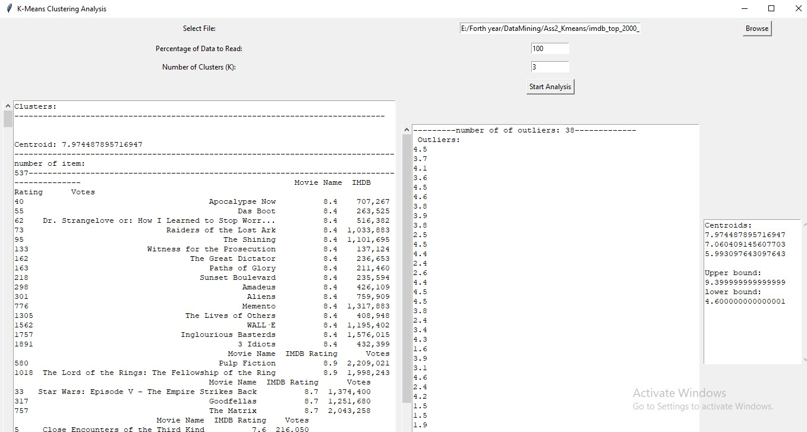

## K-Means Clustering Analysis Tool

This Python script provides a graphical user interface (GUI) for performing K-Means clustering analysis on IMDb movie ratings data. The tool allows users to select a CSV file containing movie data, specify the percentage of data to analyze, and choose the number of clusters (K) for the analysis. It then performs K-Means clustering on the selected data and displays the resulting clusters, centroids, and outliers.

### Functionality:

- **Select File:** Allows users to browse and select a CSV file containing movie data.
- **Percentage of Data to Read:** Specifies the percentage of data from the selected file to use for analysis.
- **Number of Clusters (K):** Specifies the number of clusters for K-Means clustering.
- **Start Analysis:** Initiates the analysis process, performing K-Means clustering and displaying the clusters, centroids, and outliers.

### Inputs:

- **CSV File:** Input file containing movie data with columns 'Movie Name', 'IMDB Rating', and 'Votes'.
- **Percentage of Data:** Percentage of data from the input file to use for analysis.
- **Number of Clusters (K):** Number of clusters to form during K-Means clustering.

### Output:

- **Clusters:** Displays the clusters formed by K-Means clustering, along with the movies belonging to each cluster.
- **Centroids:** Displays the centroids of the clusters.
- **Outliers:** Displays the outliers detected in the data.

### Output Shape:

- **Clusters:** Textual representation of clusters, with each cluster showing the centroid and the movies belonging to it.
- **Centroids:** Textual representation of the centroids of the clusters.
- **Outliers:** Textual representation of the outliers detected in the data.

### Requirements:

- Python 3.x
- Required Python libraries: `tkinter`, `pandas`, `numpy`, `sklearn`, `collections`

### Usage:

1. Clone or download this repository.
2. Install the required Python libraries if not already installed (`pip install pandas numpy scikit-learn`).
3. Run the script `kmeans_analysis.py`.
4. Use the GUI to select a CSV file, specify parameters, and start the analysis.

## UI images

